<h1 align="center">Performance and accesibility improvements volkswagen.nl</h1>

<p align="center"><b>An example and report that show performance and accesilibity improvements for the volkswagen.nl website.</b></p>

<br>

<p align="center">
  <a href="https://volkswagen-improvements.herokuapp.com/">
    
  </a>
</p> 

<br>

## Introduction
Performance and accessibility improvements are made for the volkswagen.nl website as part of a course from [@cmda-minor-web 18-19](https://github.com/cmda-minor-web/browser-technologies-1819).

Some resources possess an emoticon to help you understand which type of content you may find:

- 📖: Documentation or article
- 🛠: Tool or library
- 📹: Video

## Table of Contents

- [Performance](#performance)
  - [Images to WebP](#images-to-webp)
  - [Compression](#Compression)
  - [Revisioning and cache control](#revisioning-and-cache-control)
- [Accessibility](#accessibility)
  - [Iframes](#iframes)
  - [Contrast](#contrast)
  - [Image placeholders](#image-placeholders)
- [Sources](#sources)

## Performance

### Images to WebP
Implement <b>webP images</b> by using the `<picture>` element. Browsers that don't support `<picture>` or the <b>webP image format</b> will ignore them and render the fallback image in the `` element.

<b>Code example</b>

```html
<picture>
  <source srcset="{{image}}" type="image/webp">
  <source srcset="{{image_fallback}}" type="image/jpeg">
  
</picture>
```

<details>
  <summary>Picture element support</summary>

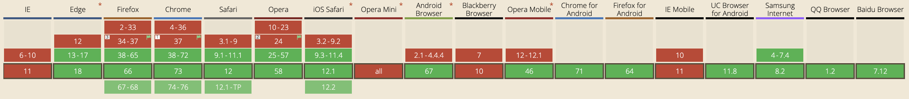

</details>

<details>
  <summary>WebP Image format support</summary>

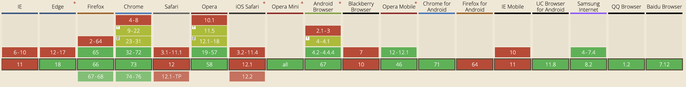

</details>

#### Result
<details>
  <summary>Network result - based on fast 3G network</summary>
  
  **JPG and PNG**
  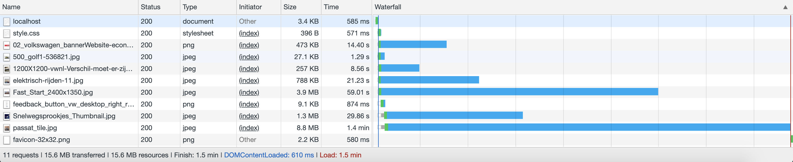

  **WebP**
  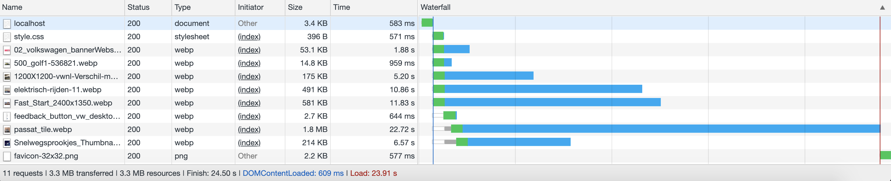

</details>

<br>

<b>File size</b>

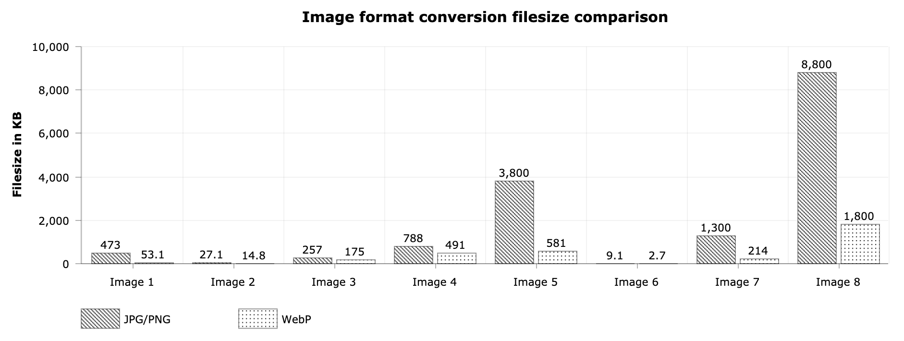

```
from 473 KB to 53.1 KB = 88.8% reduction
from 27.1 KB to 14.8 KB = 45.4% reduction
from 257 KB to 175 KB = 31.9% reduction
from 788 KB to 491 KB = 37.7% reduction
from 3.8 MB to 581 KB = 84.7% reduction
from 9.1 KB to 2.7 KB = 70.3% reduction
from 1.3 MB to 214 KB = 83.5% reduction
from 8.8 MB to 1.8 MB = 79.5% reduction
```

```diff
+ Average image size reduction: 64.7%
```

<b>Load time</b>

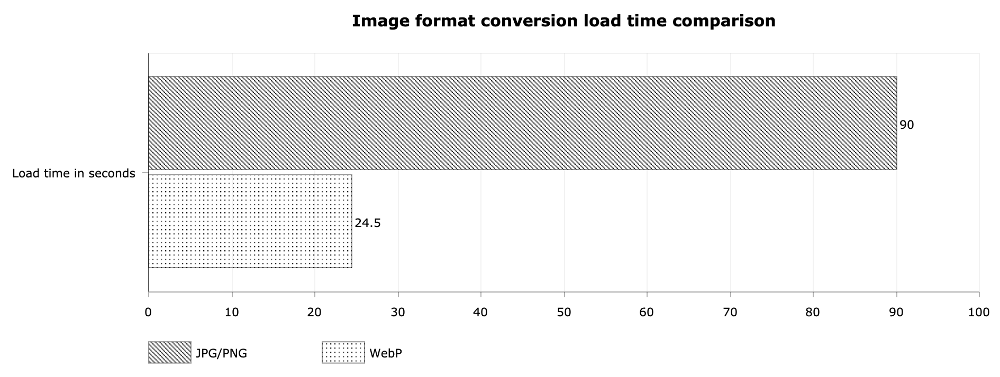

```diff
+ Load time reduction: 72.8%
```

> * 📖 [Google: A new image format for the Web](https://developers.google.com/speed/webp/)
> * 📖 [Mozilla: HTML picture element](https://developer.mozilla.org/en-US/docs/Web/HTML/Element/picture)
> * 🛠 [Can I use](https://caniuse.com/)

### Compression
Currently all compression is done with GZIP. Most (modern) browsers include Accept-Encoding headers for Brotli as well, which is better.

<details>
  <summary>Network result - based on fast 3G network</summary>

  <br>

**Without compression**
```
HTML: Size 21.9 KB | Time 1.04s
CSS: Size 280 KB | Time 8.72 s
JS: Size 472 KB | Time 14.83 s

18 requests | 4.6 MB transferred | Finish 27.16 s | DOMContentLoaded: 15.99 s | Load 26.57 s
```

**With Gzip**
```
HTML: Size 13.8 KB | Time 639 ms
CSS: Size 35 KB | Time 1.67 s
JS: Size 144 KB | Time 6.18 s

17 requests | 3.9 MB transferred | Finish 23.77 s | DOMContentLoaded: 7.01s | Load 23.15 s
```

**With Brotli**
```
HTML: Size 11.1 KB | Time 628 ms
CSS: Size 27.7 KB | Time 1.38 s
JS: Size 123 KB | Time 5.63 s

18 requests | 3.8 MB transferred | Finish 23.4 s | DOMContentLoaded: 6.41s | Load 22.51 s
```

**Table**
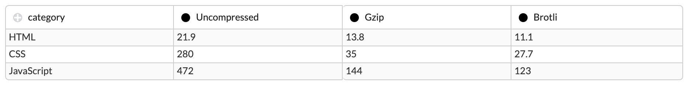

</details>

<br>

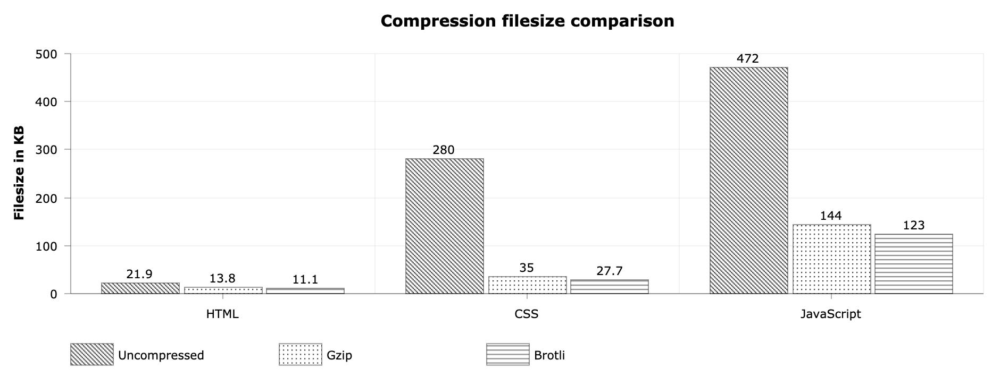

Reductions based on the use of brotli and previous use of GZIP. _Note: don't forget to compress SVG's too._

```diff
+ HTML Size reduction: 22.6 %
+ CSS Size reduction: 21,1 %
+ JS Size reduction: 14,6 %
```

> * 📖 [Introducing Brotli: a new compression algorithm](https://opensource.googleblog.com/2015/09/introducing-brotli-new-compression.html)
> * 🛠 [Brotli by Google](https://github.com/google/brotli/)


### Revisioning and cache control
I took a closer look at the Response Headers from certain files (on repeat view) and noticed something strange. Lets take the `styles.min.css` file as an example.


At first glance this looks great. The file is cached on the disk, so it will be preserved, even when closing the browser. But what if the developers make changes to the file? Will the preserved file still be served? Yes, it will.

There are two ways to solve this. The first solution is fine, but the second solution should always be used if possible.

<b>1. Etag and If-None-Match</b>

Before I explain this solution I want to show the Response Headers from the `styles.min.css` file.

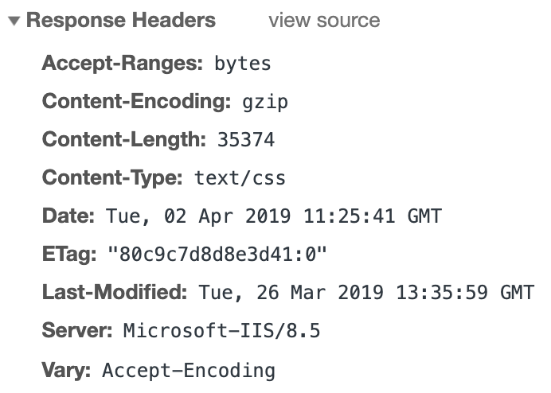

Notice the **Etag**? It's there, but it doesn't do anything. There is no "If-None-Match" request response to compare its value with. An Etag should return a `304 Not Modified`, but the file returns with status code `OK 200`. That's because `Cache-Control: no-cache` isn't set. Applying "no-cache" does not mean that there is no cache at all, it simply tells the browser to validate resources on the server before using it from the cache.

Back to the method. If an Etag is provided on first view, the "If-None-match" should be filled with its value. On repeat view, the server will check if the Etag contains the same value as the "If-None-Match" field. If it does, it will return the cached file, if it doesn't, it will load the new file; when you make changes to a file, its Etag will also change.

This means you only have to do a server request to check if the file is "already there". But there is a better way, where we don't have to do this "check".

<b>2. File revisioning</b>

With file revisioning you add unique hash digits to your file names (on build).

Example: `styles.min.css` will be called `styles-6bf023rf.min.css` instead. When you make changes to your CSS file you should give your file new unique hash digits.

This means your CSS will always be cached (and not do a request to check if it is changed). It will only do a request if the new CSS file name is not equal to the cached file name.

---

<b>HTML optimisation</b>

Everytime we load the volkswagen.nl HTML we have to load 22.8 KB. This can be solved by adding an Etag to the html, with cache-control to no-cache. Only if changes are made to the HTML, we have to load the 22.8 KB else we only have to do the request for a "check" which is 221 bytes.

<b>Comparison (on repeat view)</b>

<details>
  <summary>Live website</summary>

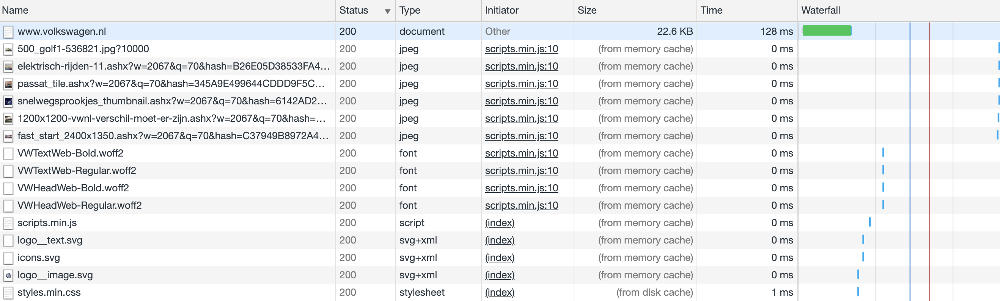

</details>

<details>
  <summary>Test environment</summary>

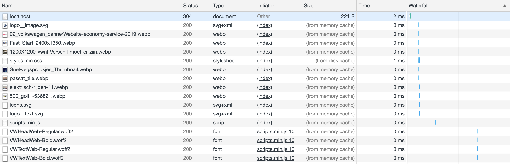

</details>

---

In conclusion my advice for the most optimal Response Headers would be:

**HTML files**
* Cache-Control: no-cache
* With Etag
* No Server

**JavaScript, CSS, and image files** 
* Cache-Control: public, max-age=31536000
* No Etag,
* No Last-Modified
* No Server

_Note: JavaScript and CSS files should have file revisioning when the above response headers are used._

## Accessbility

### Iframes

Frame titles allow web developers to communicate the purpose of each frame to users of screen readers [(WebAIM, 2013)](https://webaim.org/techniques/frames/)

**Before**
```HTML
<iframe class="... js-m-modal__iframe"></iframe>
```
**After**
```HTML
<iframe class="... js-m-modal__iframe" title="Volkswagen nieuwsbrief"></iframe>
```

> * 📖 [WebAIM: Creating Accessible Frames and Iframes](https://webaim.org/techniques/frames/)

### Contrast
Links and spans are lightblue (#00b1eb). Most of the time they are on a white background. This combination doesn't pass the [WCAG 2.0](https://www.w3.org/TR/2008/REC-WCAG20-20081211/). Contrast ratio should score above 4.01 to pass the W3 guidelines.


> * 🛠 [Contrast Ratio](https://contrast-ratio.com/)
> * 📖 [W3: Web Content Accessibility Guidelines (WCAG) 2.0](https://www.w3.org/TR/2008/REC-WCAG20-20081211/)

### Image placeholders
Consider using a background color as an image placeholder until the actual image is loaded. This way the page doesn't jump around while loading. Also, the page will look pleasant when JavaScript is disabled.

**Before**
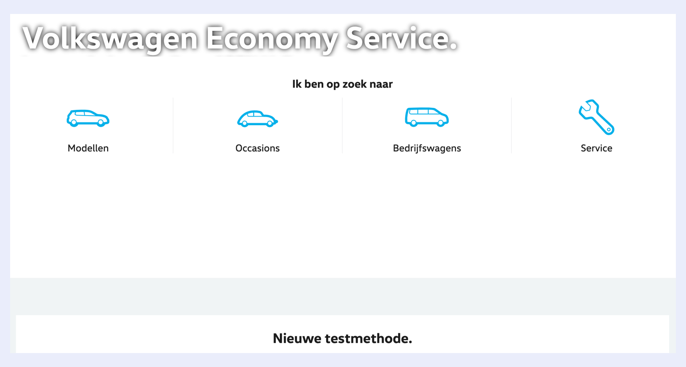

**After**
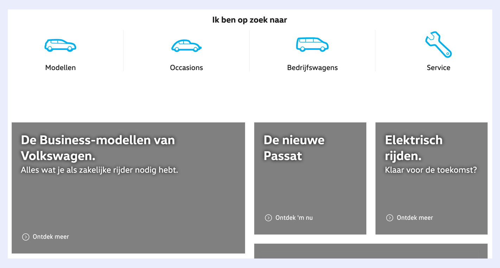

## Sources
Underneath you will find all the sources that were previously mentioned throughout the document or others which were helpful.

> * 🛠 [Contrast Ratio](https://contrast-ratio.com/#%23cf4436-on-white)
> * 🛠 [Can I use](https://caniuse.com/)
> * 🛠 [Brotli by Google](https://github.com/google/brotli/)

> * 📖 [Google: A new image format for the Web](https://developers.google.com/speed/webp/)
> * 📖 [Mozilla: HTML picture element](https://developer.mozilla.org/en-US/docs/Web/HTML/Element/picture)
> * 📖 [W3: Status Codes](https://www.w3.org/Protocols/HTTP/HTRESP.html)
> * 📖 [WebAIM: Creating Accessible Frames and Iframes](https://webaim.org/techniques/frames/)
> * 📖 [Introducing Brotli: a new compression algorithm](https://opensource.googleblog.com/2015/09/introducing-brotli-new-compression.html)
> * 📖 [W3: Web Content Accessibility Guidelines (WCAG) 2.0](https://www.w3.org/TR/2008/REC-WCAG20-20081211/)